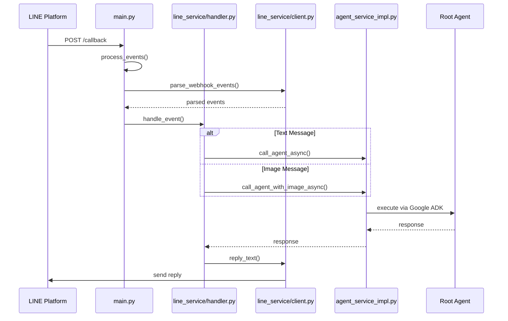
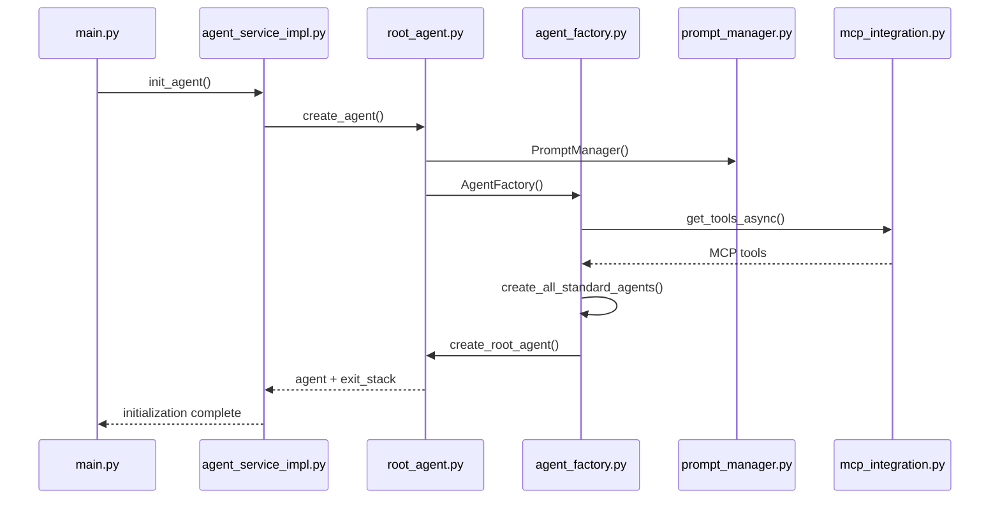
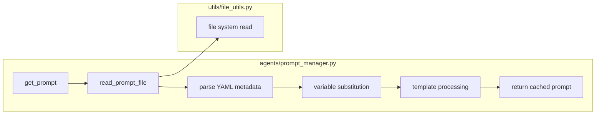
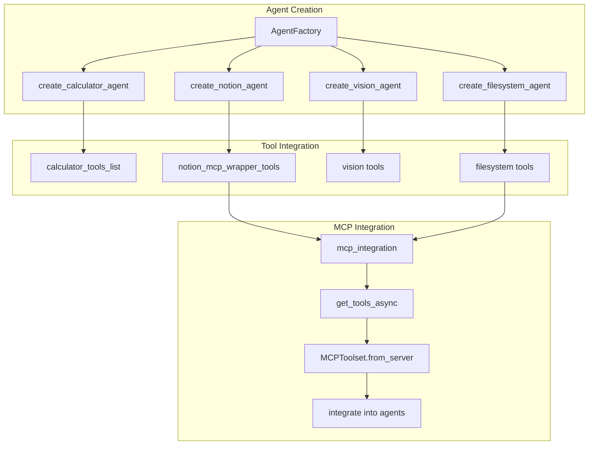

# LINE Multi-Agent Function Call Flow

このドキュメントは、LINE Multi-Agentアプリケーションにおける関数呼び出し関係をMermaidフローチャートで可視化したものです。

## 全体アーキテクチャ フロー

```mermaid
flowchart TD
    subgraph "main.py - FastAPI Application"
        callback[callback/1] --> process_events[process_events/1]
        lifespan[lifespan/1] --> init_agent[init_agent/1]
        lifespan --> init_filesystem[initialize_filesystem_service/1]
        lifespan --> check_mcp[check_mcp_server_health/1]
        health_check[health_check/1] --> check_fs_health[check_filesystem_health/1]
        health_check --> check_mcp_health[check_mcp_server_health/1]
        test_agent[test_agent_endpoint/1] --> create_agent[create_agent/1]
        test_image[test_image_recipe/1] --> agent_execute[_execute_single_attempt/1]
    end

    subgraph "agent_service_impl.py - Agent Service Layer"
        init_agent --> as_init[AgentService.init_agent/1]
        as_init --> create_agent
        call_agent_async[call_agent_async/1] --> call_agent_text[call_agent_text/1]
        call_agent_with_image[call_agent_with_image_async/1] --> call_agent_image[call_agent_with_image/1]
        call_agent_text --> execute_attempt[_execute_single_attempt/1]
        call_agent_image --> execute_attempt
        execute_attempt --> execute_response[execute_and_get_response/1]
        cleanup_resources[cleanup_resources/1] --> cleanup_exit[cleanup_exit_stack/1]
    end

    subgraph "line_service/handler.py - LINE Event Handler"
        process_events --> handle_event[handle_event/1]
        handle_event --> handle_text[handle_text_message/1]
        handle_event --> handle_image[handle_image_message/1]
        handle_text --> call_agent_async
        handle_image --> call_agent_with_image
        handle_text --> reply_text[reply_text/1]
        handle_image --> reply_text
    end

    subgraph "line_service/client.py - LINE Client"
        process_events --> parse_events[parse_webhook_events/1]
        reply_text --> create_api[create_api_client/1]
        handle_image --> get_content[get_message_content/1]
    end

    subgraph "agents/root_agent.py - Root Agent"
        create_agent --> create_prompt_mgr[PromptManager/1]
        create_agent --> create_factory[AgentFactory/1]
        create_agent --> create_all_agents[create_all_standard_agents/1]
        create_agent --> create_root[create_root_agent/1]
    end

    subgraph "agents/agent_factory.py - Agent Factory"
        create_factory --> get_mcp_tools[get_tools_async/1]
        create_all_agents --> create_calc[create_calculator_agent/1]
        create_all_agents --> create_search[create_google_search_agent/1]
        create_all_agents --> create_notion[create_notion_agent/1]
        create_all_agents --> create_vision[create_vision_agent/1]
        create_all_agents --> create_fs[create_filesystem_agent/1]
        create_all_agents --> create_url_pipeline[create_url_recipe_pipeline/1]
        create_all_agents --> create_image_pipeline[create_image_recipe_pipeline/1]
        create_root --> get_prompt[get_prompt/1]
    end

    subgraph "agents/prompt_manager.py - Prompt Manager"
        create_prompt_mgr --> get_all_prompts[get_all_prompts/1]
        get_prompt --> read_prompt[read_prompt_file/1]
        get_prompt --> substitute_vars[variable_substitution/1]
        get_prompt --> process_template[template_processing/1]
    end

    subgraph "tools/mcp_integration.py - MCP Integration"
        get_mcp_tools --> check_mcp_enabled[MCP_ENABLED/1]
        check_mcp --> get_available_tools[get_available_mcp_tools/1]
        get_mcp_tools --> create_toolset[MCPToolset.from_server/1]
    end

    subgraph "tools/calculator_tools.py - Calculator Tools"
        create_calc --> calc_tools[calculator_tools_list/1]
        calc_tools --> add_nums[add_numbers/1]
        calc_tools --> subtract_nums[subtract_numbers/1]
        calc_tools --> multiply_nums[multiply_numbers/1]
        calc_tools --> divide_nums[divide_numbers/1]
    end

    subgraph "tools/web_tools.py - Web Tools"
        create_search --> fetch_web[fetch_web_content/1]
        fetch_web --> http_get[requests.get/1]
        fetch_web --> parse_html[BeautifulSoup/1]
    end

    subgraph "tools/notion/ - Notion Tools"
        create_notion --> notion_wrapper[notion_mcp_wrapper_tools/1]
        notion_wrapper --> notion_api[Notion API calls/1]
    end

    subgraph "tools/filesystem.py - Filesystem Tools"
        init_filesystem --> fs_init[filesystem initialization/1]
        create_fs --> fs_tools[filesystem tools/1]
        check_fs_health --> fs_health[filesystem health check/1]
    end

    subgraph "utils/logger.py - Logging"
        setup_logger[setup_logger/1] --> configure_log[configure logging/1]
    end

    subgraph "utils/file_utils.py - File Utils"
        read_prompt --> read_file[file operations/1]
    end

    %% Style the subgraphs
    classDef mainApp fill:#e1f5fe
    classDef service fill:#f3e5f5
    classDef agent fill:#e8f5e8
    classDef tool fill:#fff3e0
    classDef util fill:#fafafa

    class callback,process_events,lifespan,health_check,test_agent,test_image mainApp
    class init_agent,call_agent_async,call_agent_with_image,execute_attempt,cleanup_resources service
    class create_agent,create_factory,create_all_agents,get_prompt,create_prompt_mgr agent
    class get_mcp_tools,calc_tools,fetch_web,notion_wrapper,fs_init tool
    class setup_logger,read_prompt util
```

## 主要な処理フロー

### 1. LINE メッセージ処理フロー

### 2. エージェント初期化フロー

### 3. プロンプト処理フロー

### 4. ツール統合フロー

## ファイル別主要関数一覧

### main.py
- `lifespan()` - FastAPIライフサイクル管理
- `process_events()` - LINEイベント処理
- `callback()` - Webhookエンドポイント
- `health_check()` - ヘルスチェック
- `test_agent_endpoint()` - エージェントテスト
- `test_image_recipe()` - 画像レシピテスト

### agent_service_impl.py
- `init_agent()` - エージェント初期化
- `call_agent_async()` - テキストメッセージ処理
- `call_agent_with_image_async()` - 画像メッセージ処理
- `cleanup_resources()` - リソースクリーンアップ
- `AgentService._execute_single_attempt()` - 単一実行試行

### line_service/handler.py
- `handle_event()` - LINEイベントハンドラー
- `handle_text_message()` - テキストメッセージ処理
- `handle_image_message()` - 画像メッセージ処理

### agents/root_agent.py
- `create_agent()` - ルートエージェント作成

### agents/agent_factory.py
- `create_all_standard_agents()` - 全エージェント作成
- `create_calculator_agent()` - 計算エージェント作成
- `create_notion_agent()` - Notionエージェント作成
- `create_vision_agent()` - ビジョンエージェント作成
- `create_filesystem_agent()` - ファイルシステムエージェント作成

### agents/prompt_manager.py
- `get_prompt()` - プロンプト取得
- `get_all_prompts()` - 全プロンプト読み込み

### tools/mcp_integration.py
- `get_tools_async()` - MCPツール取得
- `check_mcp_server_health()` - MCPサーバーヘルスチェック

このフローチャートは、LINE Multi-Agentアプリケーションの複雑な関数呼び出し関係を可視化し、システム全体のアーキテクチャを理解するのに役立ちます。